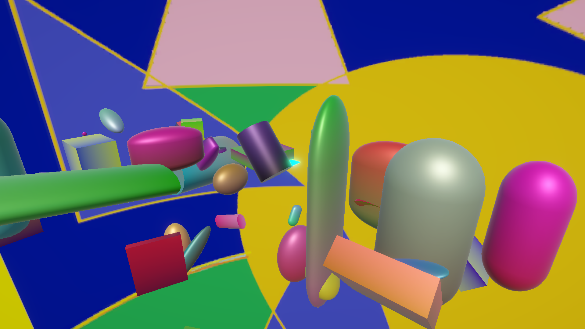

# Spinny Shapes
This is a game where you jump between random shapes of random sizes and colours, spinning around random axis under random angles and trying to get to a floating platform glowing with blue. It is very `Random`.

## Progress
**Level 1** is almost done
 More levels will be developed

## To do
- Reduce possibility of larger shapes being spawned next to the starting point
- Introduce shader to the background